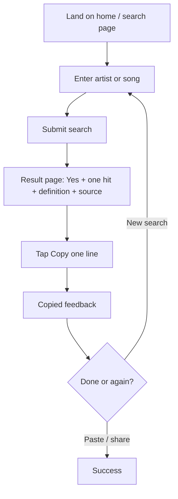
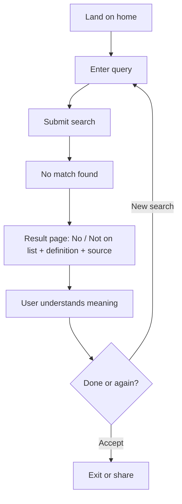

# UX Design Specification IsItAOneHitWonder

**Author:** DJ
**Date:** 2026-02-01

---

## Executive Summary

### Project Vision

IsItAOneHitWonder does one job: **search by song or artist → get a Yes/No verdict, "The one hit: [Song] – [Artist]," and a one-line definition with source always visible.** Data comes from the Wikipedia US one-hit wonder list. **Transparency is the product**—the definition and source (Wikipedia US list) are first-class in the UI and in the shareable one-line; there is no "click to see how we define it." v1 is US-only, static (Astro on GitHub Pages, HTTPS), with build-time data and client-side search. Share/copy produces one compact line that includes the definition so the answer travels with its source.

### Target Users

- **Music fans / party goers (primary):** Someone at a party names a song or artist; the user wants a quick answer and "the one hit" so they can share it. They often use the product on their phone, then copy or share one line into a chat. Success = search → verdict + one hit + definition → share one line.
- **Trivia buffs (primary):** Same core need—search by song or artist → Yes/No + the one hit + definition. They value the definition and source being always visible so they can cite it. Copy/share one line into Discord, a doc, or a message.
- **No-match / typo (primary edge case):** User searches for something not on the list or misspells. They should see a clear "No" or "Not on our list" with the same definition and source visible so the meaning is clear, not a dead end.
- **Wikipedia editors / attribution-minded (secondary):** They care that source and CC BY-SA 4.0 are visible without digging. The product’s transparency serves them by default.
- **One-hit wonder artist or fan (secondary):** They want a straight, non-dismissive answer. Framing should be factual and positive ("the one hit" prominent); definition and source visible so it’s clear this is one definition (Wikipedia US list), not a universal judgment.

### Key Design Challenges

- **One screen, full transparency:** The result page must show verdict, "The one hit" (when Yes), one-line definition, and source without requiring another click or modal. Every element is first-class.
- **Shareable one-line:** Copy/share must produce a single compact line that includes the definition (e.g. *"Yes – Chumbawamba is a one-hit wonder (Wikipedia US list). The one hit: Tubthumping."*). The UX must make this action obvious and keyboard-accessible.
- **Mobile-first and touch:** Primary use is on phone (party, trivia). Single search box and result page must work on small screens with adequate touch targets for search, copy, and share.
- **Accessibility:** WCAG 2.1 Level AA where feasible: contrast, focus order, keyboard access to search and copy/share, clear labels and landmarks so screen readers can navigate.
- **Static MPA, shareable URLs:** Astro static site, not SPA. Result pages need clean, shareable URLs (e.g. `/result/chumbawamba`) and SEO-friendly titles/meta so shared links and search landers work.
- **Visual constraint:** No purple/blue gradients as primary color (workspace rule).

### Design Opportunities

- **Transparency as differentiator:** Making definition and source visible by default is a product advantage; the UX can reinforce trust and citeability without extra steps.
- **Single flow, simple mental model:** One search box and one result page reduce cognitive load and work well for mobile and quick lookups.
- **Shareable one-line as entry point:** The compact share format can drive discovery when pasted in chats or social; the UI can highlight "Copy one line" as a primary action.
- **Positive framing:** Presenting "The one hit" prominently supports the artist/fan segment and avoids a dismissive tone while staying factual.

---

## Core User Experience

### Defining Experience

The core experience is **one action and one result:** the user types an artist or song into a single search control and lands on a result page that shows everything—verdict (Yes/No), "The one hit: [Song] – [Artist]" when Yes, and the one-line definition with source—without any further click. The critical interaction to get right is this search → result flow and the **copy one line** action: the user should be able to search, read the answer, and copy or share one compact line (including the definition) in a single, effortless sequence. If we nail this loop, the product delivers its entire value.

### Platform Strategy

- **Web, static:** Astro-built static site on GitHub Pages (HTTPS). Multiple pages (MPA): home/search page and result pages. No native app; no desktop-only assumption.
- **Mobile-first, touch-primary:** Primary use is on phone (party, trivia). Single search box and result page must work on small screens. Touch targets for search, copy, and share must be adequate (e.g. minimum 44px). Mouse/keyboard must also be fully supported for desktop and accessibility.
- **No offline requirement** beyond normal browser caching of static assets after first load; all list data is in the build, so once the page loads, search works without network.
- **Shareable URLs:** Result pages have clean URLs (e.g. `/result/chumbawamba`) for sharing and SEO; direct links to result pages should work and render the same content.
- **JS-off behavior:** JS-off fallback is deferred for MVP; no explicit message or static fallback. Revisit post-launch if needed.

### Effortless Interactions

- **Search:** One prominent search control; submit (enter or tap search) runs client-side search and shows the result page. Should feel immediate (results within ~2s of submit per NFR).
- **Result at a glance:** Verdict, one hit, definition, and source are all visible on one screen—no "click to see definition" or expand/collapse. Zero extra steps to understand the answer.
- **Copy one line:** One tap or click copies the shareable line (verdict + definition ref + one hit) to clipboard, with clear feedback (e.g. "Copied"). Keyboard-accessible. No share wizard or extra dialogs.
- **No account, no forms:** Only input is the search query; no sign-up, login, or multi-step flows.

### Critical Success Moments

- **"This is exactly what I needed":** User sees verdict + one hit + definition + source on one page and immediately understands the answer and its source. No hunting for "how do you define it?"
- **Copy works:** User taps Copy (or Share) and gets the one-line in clipboard or share sheet; pasting into chat or doc shows the full line including the definition. Success = the answer travels with its source.
- **No-match still makes sense:** When the artist/song isn't on the list (or typo), user sees "No" or "Not on our list" with the same definition and source visible—so they understand "not on this list" or "not by this definition," not "something broke."
- **Make-or-break failure to avoid:** Search failing to find a known list entry (e.g. poor fuzzy matching), or copy producing a line without the definition—either would undermine trust and the product promise.

### Experience Principles

1. **One action, one result.** Search is the only input; the result page is the only output. No secondary flows or optional steps for the core job.
2. **Transparency by default.** Definition and source are always visible on the result page and included in the shareable line—no "click to learn more."
3. **Share is first-class.** Copy (or share) one line is a primary action on the result page, obvious and keyboard-accessible, not buried in a menu.
4. **Mobile-first, touch-friendly.** Layout and targets work on phone first; desktop and keyboard are fully supported.
5. **Graceful no-match.** Same definition and source shown when there’s no match; clear "No" or "Not on our list" so the experience never feels like a dead end.

---

## Desired Emotional Response

### Primary Emotional Goals

- **Confident:** The user should feel they have the right answer—verdict, one hit, and definition are all visible at once, so there’s no “did I miss something?”
- **Trusted / trustable:** Seeing the source (Wikipedia US list) and definition by default should create trust that the answer is attributable and not arbitrary—especially for trivia buffs and Wikipedia-minded users.
- **Satisfied:** Completing the job (search → answer → copy one line) should feel complete and effortless; the “I got what I needed and can share it” moment is the target.
- **Respected (artist/fan segment):** For someone looking up an artist (or themselves), the tone should feel factual and positive—“the one hit” prominent, not “only one hit”—so they feel the product is fair and non-dismissive.

### Emotional Journey Mapping

- **First discovery:** Curious, low friction—one search box, no sign-up. The product should feel approachable and immediate.
- **During search / result:** Clarity and confidence—the result page delivers everything in one view; no second-guessing or hunting for the definition.
- **After completing the task:** Satisfaction—user has the answer and can copy or share one line; the “bet settled” or “question answered” feeling.
- **When something goes wrong (no match / typo):** Clarity, not abandonment—same definition and source visible, clear “No” or “Not on our list,” so the user understands “not on this list” rather than “something broke.”
- **Returning:** Familiar and reliable—same simple flow; the product stays easy to use on repeat visits.

### Micro-Emotions

- **Confidence vs. confusion:** One screen with verdict, one hit, definition, and source supports confidence; hidden or expandable definition would risk confusion.
- **Trust vs. skepticism:** Visible source and definition reduce skepticism; “click to see how we define it” would undermine trust.
- **Satisfaction vs. frustration:** One action → one result and a copy action that works (with feedback) support satisfaction; copy that omits the definition or unclear feedback would create frustration.
- **Respect vs. dismissiveness:** Positive, factual framing (“the one hit”) supports respect for the artist/fan segment; “only one hit” or buried definition would feel dismissive.

### Design Implications

- **Confidence:** Keep verdict, one hit, definition, and source on one screen with clear hierarchy—no modals or “learn more” for the core answer.
- **Trust:** Always show the one-line definition and source (e.g. “We use the Wikipedia US one-hit wonder list…”); include them in the shareable line so trust travels with the answer.
- **Satisfaction:** Make “Copy one line” a primary, obvious action with clear feedback (e.g. “Copied”); ensure the copied text includes the definition so the share moment feels complete.
- **Respect:** Use neutral, positive language (“The one hit: [Song] – [Artist]”); avoid wording that sounds diminishing. Keep definition/source visible so it’s clear this is one definition, not a universal judgment.
- **Avoid:** Hidden source (skepticism), copy without definition (frustration), dead-end no-match (abandonment), or dismissive tone (artist/fan alienation).

### Emotional Design Principles

1. **Design for confidence.** Answer and source are visible together; the user never has to wonder “where did this come from?”
2. **Design for trust.** Transparency by default—definition and source are first-class in the UI and in the shareable line.
3. **Design for satisfaction.** Minimal steps, clear copy feedback, and a shareable line that includes the definition so the job feels done.
4. **Design for respect.** Neutral, factual framing; “the one hit” is prominent and positive for the artist/fan segment.
5. **Avoid confusion and dead ends.** Graceful no-match with the same definition and source; no experience that feels broken or opaque.

---

## UX Pattern Analysis & Inspiration

### Inspiring Products Analysis

Products and patterns that align with our target users (music fans, trivia buffs, mobile lookup) and our goals (one search → one result, transparency, share one line):

- **Wikipedia / reference sites:** Source and attribution are visible; definitions and citations are first-class. Users can cite without digging. *Lesson:* Adopt visible source and one-line definition by default—no "learn more" for the core answer.
- **Search engines’ instant answers (e.g. DuckDuckGo, Google one-box):** One query → one clear answer in a compact block. *Lesson:* Adopt single-query, single-result mental model; one search box, one result page with everything in view.
- **Lookup / database sites (e.g. IMDb, Wikipedia disambiguation):** One search, one page with key info and clear hierarchy (title/headline, then supporting detail). *Lesson:* Adopt clear typographic hierarchy—verdict as headline, "The one hit" prominent, definition/source as readable supporting content.
- **Messaging and share UX:** One-tap copy, clear feedback ("Copied"), share sheet for native share. *Lesson:* Adopt prominent copy action with immediate feedback; avoid multi-step share wizards for the core "copy one line" job.

### Transferable UX Patterns

- **Navigation:** Single search as home; result page as the only other main view. Minimal global nav; optional footer for attribution and "How we define it." Fits our one-action, one-result flow.
- **Interaction:** Search submit (enter or tap) → navigate to result page or show result in place. One primary action on result page: "Copy one line" (and optionally native Share). Clear loading/feedback on submit so the experience feels immediate.
- **Visual:** Strong hierarchy—verdict (Yes/No) as the main answer; "The one hit" as hero line; definition and source as visible, readable text (not fine print). Source link styled as attribution, not a primary CTA. Copy button is a primary action (size, placement, label).
- **Content:** One screen holds verdict, one hit, definition, and source; no accordion or "click to expand" for core content. Fits mobile-first and transparency.

### Anti-Patterns to Avoid

- **Definition or source behind a click:** "How we define it" or "Source" as a link that reveals the definition breaks transparency and trust. Definition and source must be visible on the result page by default.
- **Copy/share buried or multi-step:** Burying "Copy one line" in a menu or forcing a share wizard adds friction. Copy (and optional Share) should be one tap with clear feedback.
- **Result page that hides key info below the fold:** If the user must scroll to see the definition or source, confidence and trust suffer. Core content should be in the initial viewport on mobile.
- **Purple/blue gradient as primary:** Workspace rule; choose a different primary palette.
- **Unclear search feedback:** No feedback on submit (e.g. loading state) or vague "no results" without definition/source creates confusion. Submit should have feedback; no-match should show the same definition and source.

### Design Inspiration Strategy

- **Adopt:** One-query, one-answer mental model (instant-answer style). Visible source and definition on the result page (Wikipedia/reference style). Prominent copy action with clear feedback (messaging/share style). Clear typographic hierarchy (verdict → one hit → definition/source).
- **Adapt:** Simpler than Wikipedia—one list, one definition, no article. Result page is the whole answer; optional "How we define it" for edge cases only. Copy produces one compact line (verdict + definition ref + one hit), not a long excerpt.
- **Avoid:** Hidden definitions, share wizards for the core action, primary purple/blue gradients, result layout that buries definition or source below the fold, or no-match states that omit definition/source.

---

## Design System Foundation

### 1.1 Design System Choice

**Utility-first CSS (e.g. Tailwind CSS) with custom design tokens and a small set of custom components.** No full-scale component library (Material, Ant, etc.); the UI is minimal (search, result block, copy/share button, footer) and benefits from a lightweight, customizable foundation that works well with Astro and supports mobile-first layout, touch targets, and WCAG AA without excess weight.

### Rationale for Selection

- **Platform fit:** Astro static site with minimal client-side JS; Tailwind (or similar) integrates cleanly with Astro and produces small, purged CSS. No need for a heavy component framework.
- **Scope and speed:** Solo or very small team (per PRD); utility-first speeds layout and consistency. Custom tokens (color, type, spacing) define the brand without adopting a full design system’s look.
- **Constraints:** Mobile-first and touch targets (e.g. 44px min) are straightforward with spacing utilities. “No purple/blue as primary” is easy—define a custom palette in config.
- **Accessibility:** Contrast and focus states can be enforced via utilities and tokens; headings and landmarks are semantic HTML with utility-driven visuals. No dependency on a third-party component library’s a11y behavior.
- **Uniqueness:** Typography and color are project-defined; the one-job, transparency-first experience is expressed through hierarchy and copy, not through a generic component set.

### Implementation Approach

- **Foundation:** Tailwind CSS (or equivalent utility-first approach) via Astro integration; design tokens in `tailwind.config` (and/or CSS custom properties) for color, type scale, and spacing.
- **Components:** Small set of custom Astro components (or minimal islands if interactivity is needed): search form, result block (verdict, one hit, definition, source), copy button, optional share button, footer (attribution, optional “How we define it” link). No generic card/modal/drawer library unless a clear need emerges.
- **Hierarchy:** Token-driven type scale (e.g. verdict = largest, one hit = hero, definition/source = body/small) and spacing so the result page reads in one glance on mobile.
- **Assets:** Minimal; no heavy icon set—inline SVG or a tiny set for search, copy, share, and external link (attribution) where needed.

### Customization Strategy

- **Color:** Define a primary palette that is not purple/blue-dominated (e.g. warm accent, or neutral with one accent); ensure sufficient contrast for text and interactive elements (WCAG AA). Use tokens for background, text, links, and buttons.
- **Typography:** Choose a readable, web-safe or webfont stack; scale for verdict → one hit → body → small (source/attribution). Line height and measure support readability on small screens.
- **Spacing and touch:** Use a consistent spacing scale; ensure interactive elements (search submit, copy, share) meet minimum touch target size (e.g. 44px) on mobile.
- **Borders and emphasis:** Use sparingly to support hierarchy (e.g. verdict or one-hit block) without clutter. Attribution/source can be visually secondary (e.g. smaller type, link style) but still visible.
- **Future:** If the product grows (e.g. quiz, extra pages), the same tokens and utility patterns extend; add components only when the same pattern repeats.

---

## Defining Core Experience

### 2.1 Defining Experience

The defining experience is: **"Search once, get the answer—and share one line that includes the definition."** The user types an artist or song, sees Yes/No plus "The one hit" (when Yes), the one-line definition, and the source—all on one screen—then taps Copy and gets one compact line they can paste anywhere. If we nail this flow, the product delivers its entire value; everything else (footer, optional "How we define it") supports it.

### 2.2 User Mental Model

- **How users think:** "I'll look it up"—like a dictionary or search. They expect: type something, get an answer. No account, no forms beyond the query.
- **Current solutions:** Wikipedia's list is a long page, not a lookup; other sites rarely state definition or source. Users work around by scanning or guessing.
- **Expectation:** One place, one answer, and the ability to cite or share it so the definition travels with the answer.
- **Confusion risks:** Hidden definition ("click to see how we define it"), copy that omits the definition, or no-match that feels like a dead end. Our design avoids these by making definition and source always visible and part of the shareable line.

### 2.3 Success Criteria

- **"This just works":** Search → result page with verdict, one hit, definition, and source in one view; no second step to see the definition.
- **Feel accomplished:** User has the answer and can copy one line; "Copied" (or equivalent) confirms; pasting shows the full line including the definition.
- **Feedback:** Result page shows everything; copy button gives immediate, clear feedback. Search submit shows loading or transition so the experience feels responsive (result within ~2s per NFR).
- **Automatic:** Definition and source appear by default—no user action required to "reveal" them.

### 2.4 Novel UX Patterns

- **Mostly established:** Search → result and copy button are familiar. Users don't need to learn a new interaction.
- **Our twist:** Definition and source are first-class on the result page and in the shareable line—no "learn more" or expand. Transparency is the differentiator; the pattern is "lookup + copy" with everything visible.
- **No novel interaction:** We're not inventing a new gesture or flow; we're applying a familiar pattern (instant-answer lookup, one-tap copy) with a transparency-first content strategy.

### 2.5 Experience Mechanics

**1. Initiation:** User lands on the home page and sees one prominent search control (artist or song). No sign-up or onboarding; the search box invites the first action.

**2. Interaction:** User types a query and submits (Enter or tap search). System runs client-side search and navigates to the result page (or shows the result in place). Result page displays: verdict (Yes/No), "The one hit: [Song] – [Artist]" when Yes, one-line definition, and source. Primary action on result page: "Copy one line" (and optionally native Share).

**3. Feedback:** While search runs: loading or transition (e.g. brief state so the user knows something is happening). On result: full content visible at once. On copy: clear feedback (e.g. "Copied" or button state change). If no match: same definition and source visible, clear "No" or "Not on our list."

**4. Completion:** User has the answer and, if they tapped Copy, the shareable line in clipboard. Success = they can paste into chat or doc and the line includes the definition. Next: paste elsewhere, share the URL, or run another search.

---

## Visual Design Foundation

### Color System

- **Constraint:** No purple/blue gradients or purple/blue as primary color (workspace rule).
- **Strategy:** Choose a primary palette that supports trust and clarity—readable text, sufficient contrast, one clear accent for actions (search submit, copy button, links). Options: warm accent (e.g. amber, orange, or terracotta), green (positive/trust), or neutral (grays) with a single accent for CTAs.
- **Semantic mapping:** Primary (accent for buttons, key links); background (page and card/section if used); text primary (verdict, one hit, body); text secondary (source, attribution, small copy); link (accent or underlined); focus ring (high-contrast outline). Verdict (Yes/No) can use semantic color (e.g. green for Yes, neutral for No) or stay neutral for a minimal look.
- **Accessibility:** All text and interactive elements meet WCAG 2.1 Level AA contrast (e.g. 4.5:1 for normal text, 3:1 for large text and UI). Define tokens in Tailwind config (or CSS custom properties) so contrast is consistent.

### Typography System

- **Tone:** Clear, readable, and confident—supports the “one answer” feel. Avoid decorative or playful fonts that could undermine trust.
- **Content:** Mostly short content: verdict (1–2 words), one hit (one line), definition (one line), source (one line). Headings and body; no long-form articles.
- **Type scale:** Verdict = largest (e.g. display or h1 size); “The one hit” = hero (h2 or prominent); definition and source = body and small. Establish a consistent scale (e.g. 1.25 or 1.2 ratio) so hierarchy is obvious on mobile.
- **Font pairing:** Primary typeface for headings and body; can be a single family with weight/size variation. Web-safe or webfont; ensure load performance stays light for static site.
- **Readability:** Line height and max width (measure) support readability on small screens; body and small text at least 16px equivalent for mobile to avoid zoom.

### Spacing & Layout Foundation

- **Base unit:** Consistent spacing scale (e.g. 4px or 8px base) applied via Tailwind (or utility classes). Use the same scale for padding, margins, and gaps.
- **Density:** Balance clarity with compactness—enough white space between verdict, one hit, definition, and source so the hierarchy reads at a glance; not so dense that mobile feels cramped.
- **Touch targets:** Interactive elements (search submit, copy, share) meet minimum 44px height/width (or equivalent tap area) on mobile.
- **Layout:** Single-column for home and result page; content centered or left-aligned with max-width for readability on desktop. No multi-column requirement for v1; optional grid if future pages need it.
- **Mobile-first:** Layout and spacing designed for small viewport first; scale up with breakpoints for larger screens.

### Accessibility Considerations

- **Contrast:** All text and UI components meet WCAG AA contrast ratios; color is not the only way to convey meaning (e.g. verdict Yes/No can also be clear wording).
- **Focus:** Visible focus indicators on search input, submit, copy, share, and links; style so they are obvious (e.g. 2px outline) and meet contrast.
- **Text:** Support user font-size preferences (relative units where appropriate); avoid fixed small text for essential content.
- **Semantics:** Use headings (e.g. h1 for verdict or page title, h2 for “The one hit”), landmarks (main, nav if needed, footer), and labels/aria so screen readers can navigate search, result content, and copy/share.
- **Copy/share:** Copy and share controls have accessible names (e.g. “Copy one line” or aria-label) and are keyboard-operable.

---

## Design Direction Decision

### Design Directions Explored

Four design directions were generated and are available in **`ux-design-directions.html`** (in this folder) for side-by-side comparison:

1. **Minimal neutral** — Grays and near-black; lots of white space; clear hierarchy with no accent color. Verdict and one hit in dark text; definition and source in muted gray; copy button matches neutral tone.
2. **Warm accent** — Warm off-white background; terracotta/amber accent (#c45a2b) for search border, button, and links. Same content hierarchy; feels approachable and distinct without purple/blue.
3. **Trust green** — Light green tint; green accent (#2d6a2d) for primary actions and links. Supports “trust” and “citeable” emotional goals; Yes/No can stay text-only or use green for Yes.
4. **Compact** — Tighter spacing and slightly smaller type; same content order. Suits users who prefer density; touch targets still meet minimum size.

All directions use the same content structure (search → verdict → one hit → definition → source → copy) and avoid purple/blue as primary (workspace rule).

### Chosen Direction

**Recommended baseline: Direction 1 (Minimal neutral) or Direction 2 (Warm accent).** Lock in after stakeholder review of `ux-design-directions.html`. Direction 1 maximizes clarity and works for any future accent; Direction 2 adds personality and differentiation while staying on-brand. Direction 3 (Trust green) is a strong alternative if “trust” and “source” should be emphasized visually. Direction 4 (Compact) can be applied as a density variant on top of 1, 2, or 3 if needed.

If no preference is stated, proceed with **Direction 1** for implementation and refine color/weight in a later pass.

### Design direction (locked)

**Stakeholder decision needed:** Lock Direction 1 (Minimal neutral) or Direction 2 (Warm accent) before visual implementation. Product owner should confirm before developers apply Tailwind tokens. Use the chosen direction consistently across all components.

### Design Rationale

- **Minimal neutral:** Fits “one job,” transparency, and confidence; no visual noise; easy to extend with an accent later.
- **Warm accent:** Aligns with “approachable” and “shareable”; terracotta/amber is distinct and avoids purple/blue; works on mobile.
- **Trust green:** Aligns with emotional goals (trust, citeability); green is commonly associated with “go”/positive without being playful.
- **Compact:** Supports “fast lookup” and small screens where every pixel counts; must preserve 44px touch targets and readability.

### Implementation Approach

- Use the chosen direction’s color and spacing as the source for Tailwind (or CSS) design tokens in implementation.
- Build the home/search page and result page to match the showcase: one search control, result block (verdict, one hit, definition, source), and “Copy one line” as primary action.
- Revisit `ux-design-directions.html` when refining visual polish or A/B testing accents (e.g. warm vs. green).

---

## User Journey Flows

### Primary success journey (music fan / trivia buff)

**Goal:** Search by artist or song → get Yes/No + one hit + definition + source → copy one line to share.

**Entry:** User lands on home (direct, search, or shared link). Sees one search box.

**Flow:** Enter query → Submit (Enter or tap Search) → Result page shows verdict, "The one hit" (when Yes), definition, source → Tap "Copy one line" → Feedback ("Copied") → Done (paste elsewhere, or run another search).

**Success:** User has the answer and a shareable line (including definition) in clipboard. No extra steps to see definition or source.

### No-match journey (edge case)

**Goal:** When the artist/song isn’t on the list (or typo), user gets a clear "No" or "Not on our list" and still sees definition and source so the outcome is understandable.

**Entry:** Same as primary—user searches from home.

**Flow:** Enter query → Submit → Result page shows **No** (or "Not on our list") with the **same** one-line definition and source visible → User understands "not on this list" or "not by this definition" → Done or try another search.

**Success:** No dead end; definition and source are visible so the result is trustworthy and shareable.

### Wikipedia editor / attribution-minded (secondary)

**Goal:** See source and CC BY-SA 4.0 without extra steps.

**Flow:** Same as primary or no-match—user lands on home or a shared result page. On the result page, definition and source are always visible; footer (or attribution area) has source link and license link. No "About" or "How we define it" required for basic trust. Shareable line includes the definition (and implicitly the source).

**Design note:** No separate flow; transparency is built into the result page and copy output.

### One-hit wonder artist or fan (secondary)

**Goal:** Get a straight, non-dismissive answer; see "the one hit" prominently.

**Flow:** Same search → result flow. Result page uses positive, factual framing ("The one hit: [Song] – [Artist]"); definition and source visible so it’s clear this is one definition (Wikipedia US list). Copy one line works the same. No separate journey mechanics.

### Journey patterns

- **Single entry:** Home with one search control; no sign-up or onboarding.
- **One result surface:** Result page always shows verdict + (when Yes) one hit + definition + source in one view—no progressive disclosure for core content.
- **Single primary action on result:** "Copy one line" (and optionally Share); same for Yes and No outcomes.
- **Consistent no-match:** No-match uses the same layout and definition/source as success; only the verdict line changes (No / Not on our list).
- **Shareable URL:** Result pages have stable URLs so shared links open the same content (SEO and sharing).

### Flow optimization principles

- **Minimize steps to value:** Search → result is two steps (enter + submit); result page has no "next" for core content.
- **Low cognitive load:** One search box; one result block; one primary action (Copy). No decisions except "what to search" and "copy or search again."
- **Clear feedback:** Loading/transition on submit; full result on page; "Copied" (or equivalent) on copy.
- **Graceful no-match:** Same definition and source as success path; clear wording so users don’t think the product failed.
- **Delight moment:** "This is exactly what I needed" when the full answer and copy work in one place.

---

## Component Strategy

### Design System Components

The chosen foundation is **utility-first CSS (Tailwind)** with custom tokens—no pre-built component library. Available “components” are primitives styled with utilities:

- **Inputs:** Text input styled with tokens (border, padding, focus ring); no dedicated “Search” component from the system.
- **Buttons:** Button styling via utilities (background, padding, border-radius, focus); primary/secondary via token classes.
- **Typography:** Headings and body via type scale and utility classes.
- **Spacing/layout:** Flexbox and grid via utilities; no card or panel component—we build layout with utilities.

**Gap:** We need custom components for (1) search form, (2) result block, (3) copy (and optional share) action, (4) footer/attribution. These are not provided by Tailwind; we define them and implement with Astro + Tailwind tokens.

### Custom Components

#### Search form

- **Purpose:** Single entry point for the core task—user enters artist or song and submits.
- **Usage:** Home page only; one per page; above the fold on mobile.
- **Anatomy:** Text input (placeholder e.g. “Artist or song”) + submit control (button or submit input). Optional: label (visible or sr-only).
- **States:** Default; focus (visible focus ring); disabled (if ever needed); optional loading (e.g. disabled + “Searching…” during client-side search).
- **Variants:** Full-width on mobile; can constrain width on desktop. Single variant sufficient for v1.
- **Accessibility:** Label associated with input (“Search by artist or song” or equivalent); submit has accessible name (“Search”); keyboard: Tab to input, type, Enter to submit. Focus order: input then submit.
- **Content guidelines:** Placeholder is short and instructional; no prefill required.
- **Interaction:** User types; Enter or tap/click submit runs search and navigates to result page (or shows result in place).

#### Result block

- **Purpose:** Presents verdict, “The one hit” (when Yes), definition, and source in one coherent block—no progressive disclosure.
- **Usage:** Result page only; one per result; primary content of the page.
- **Anatomy:** Verdict (Yes/No or “Not on our list”); optional one-hit line (“The one hit: [Song] – [Artist]”); one-line definition; source line (text + link to Wikipedia list + license link). Order fixed for hierarchy.
- **States:** Yes result (verdict + one hit + definition + source); No result (verdict + definition + source, no one-hit line). No loading state inside block (page-level loading if needed).
- **Variants:** Same structure for Yes and No; only presence of “one hit” line differs. Optional: semantic color for Yes (e.g. green) vs neutral for No—can be a variant.
- **Accessibility:** Verdict as heading (e.g. h1) or aria-label; one hit and definition as readable text; source and license as links. Landmark (main) wraps result. Screen reader can navigate to verdict, one hit, definition, source in order.
- **Content guidelines:** Definition and source text per PRD (e.g. “We use the Wikipedia US one-hit wonder list: one top-40 hit in the US.”). Links: descriptive (“Source: Wikipedia US list”, “CC BY-SA 4.0”).
- **Interaction:** Read-only; no interaction inside the block except following links.

#### Copy button (and optional Share)

- **Purpose:** Copy the shareable one-line (verdict + definition ref + one hit) to clipboard; primary action on result page.
- **Usage:** Result page only; one primary “Copy one line” button; optionally a “Share” control that uses Web Share API where available.
- **Anatomy:** Button with label “Copy one line” (or “Copy” with aria-label “Copy one line”); optional icon. After click: feedback (e.g. “Copied” or icon/label change).
- **States:** Default; hover/focus (visible focus ring); active/pressed; post-copy (“Copied” for a few seconds then revert). Disabled only if clipboard API unavailable (rare).
- **Variants:** Primary style (accent background); sufficient size for touch (min 44px). Optional secondary “Share” button same size.
- **Accessibility:** Accessible name “Copy one line”; keyboard operable (Enter/Space); focus visible. Feedback is announced (aria-live or visible text change). Share: accessible name “Share” or “Share result”.
- **Content guidelines:** Button label clear and action-oriented; feedback immediate and brief.
- **Interaction:** Click/tap copies predefined string to clipboard; optional Share opens native share sheet when available.

#### Footer (attribution)

- **Purpose:** Persistent attribution: source (Wikipedia US list) and CC BY-SA 4.0; optional “How we define it” link.
- **Usage:** Site-wide; bottom of home and result pages.
- **Anatomy:** One or two lines: source link, license link; optional “How we define it” link. Minimal visual weight (small type, secondary color).
- **States:** Default; link hover/focus.
- **Variants:** Single variant; can be same on all pages.
- **Accessibility:** Links have descriptive text; focus visible; keyboard operable.
- **Content guidelines:** “Source: Wikipedia US list” (link to list page); “CC BY-SA 4.0” (link to license). Optional “How we define it” to a short page or section.
- **Interaction:** Links only; no other interaction.

### Component Implementation Strategy

- **Build with design system tokens:** Use Tailwind (or CSS custom properties) for color, type scale, spacing, focus ring. Custom components consume tokens, not hard-coded values.
- **Astro components:** Implement as Astro components (or minimal islands if client JS needed for search or copy). Result block and footer are static; search form and copy button may need client interactivity.
- **Consistency:** Same spacing scale, focus style, and button treatment across Search, Copy, and Footer links.
- **Accessibility:** Every custom component meets WCAG AA where applicable (contrast, focus, labels, keyboard). Test copy button and search form with keyboard and screen reader.
- **Reuse:** Search form and Result block are the main reusable patterns; Copy and Footer are simple and can be included once per result page.

### Implementation Roadmap

- **Phase 1 – Core (MVP):** Search form, Result block, Copy button. Required for primary and no-match journeys. Build in order: Search form → Result block (with static example) → Copy button (with clipboard logic). Then wire search to client-side lookup and result page.
- **Phase 2 – Supporting:** Footer with source and license links; optional Share button (Web Share API). Enables attribution journey and improves share on supported devices.
- **Phase 3 – Enhancement:** Optional “How we define it” page and link; loading state for search submit; any visual polish (e.g. transition on result). Improves edge-case clarity and perceived performance.

---

## UX Consistency Patterns

### Button Hierarchy

- **One primary action per screen.** Home: search submit is primary. Result page: “Copy one line” is primary; optional “Share” is secondary (same size, lower visual weight or outline style).
- **When to use:** Primary = the single most important action on that screen. Secondary = optional or follow-up (e.g. Share, “Search again” link).
- **Visual design:** Primary uses accent background and sufficient contrast; min 44px touch target. Secondary can be outline or text-style; same focus ring and keyboard support.
- **Behavior:** Primary and secondary both keyboard-operable (Enter/Space); focus order matches visual order.
- **Accessibility:** Every button has an accessible name; focus visible; no reliance on color alone.
- **Mobile:** Touch targets at least 44px; adequate spacing between buttons so tap targets don’t overlap.

### Feedback Patterns

- **Success (copy):** Immediate, visible feedback—e.g. “Copied” or button label/icon change for 2–3 seconds, then revert. Optionally announce via aria-live for screen readers.
- **Search in progress:** Brief loading state (e.g. disabled submit + “Searching…” or spinner) so the user knows the system is working. Keep under ~2s per NFR where possible.
- **No-match:** Not an error—same result layout with verdict “No” or “Not on our list” and the same definition/source. No error message tone; clear, neutral copy.
- **Error (rare):** If search fails unexpectedly (e.g. client-side error), show a short, actionable message and a way to try again (e.g. “Something went wrong. Try again.” + focus on search).
- **When to use:** Copy = always on copy action. Loading = on submit until result is shown. No-match = standard result state. Error = only on actual failure.
- **Accessibility:** Feedback visible and/or announced; don’t rely on color alone; ensure sufficient contrast.

### Form Patterns

- **Single search input:** One text field; placeholder “Artist or song”; no multi-field form. Submit on Enter or tap/click Search.
- **Validation:** Optional: empty submit can show “Enter an artist or song” or simply do nothing; no heavy validation for v1. No inline error styling unless we add validation.
- **When to use:** Search form on home only; result page has no form (only Copy/Share).
- **Visual design:** Input and submit use design tokens; focus ring on input and button; label visible or sr-only.
- **Behavior:** Enter submits; button submits; no autocomplete required for v1 (can be added later).
- **Accessibility:** Label associated with input; submit has accessible name; keyboard flow: Tab to input, type, Enter to submit.
- **Mobile:** Input and button full-width or comfortable width; input font size at least 16px to avoid zoom on iOS.

### Navigation Patterns

- **Minimal navigation for v1:** No global nav bar. Two “pages”: home (search) and result. User reaches result by submitting search; “back” is browser back or searching again (optional “Search again” link on result page).
- **When to use:** Link to home from result page only if we add a “Search again” or logo link; footer links (source, license, optional “How we define it”) are secondary navigation.
- **Visual design:** Links use link style (underline or accent color); footer links smaller, secondary color.
- **Behavior:** Standard links; open in same tab (internal) or new tab for external (Wikipedia, license) per preference.
- **Accessibility:** Link text descriptive (“Source: Wikipedia US list”, “CC BY-SA 4.0”, “How we define it”); focus visible; keyboard operable.
- **Mobile:** Footer links stack or wrap; touch targets adequate for optional “Search again” if present.

### Additional Patterns

- **Loading state:** Search submit: show loading (e.g. disabled + “Searching…” or spinner) until result page or result content appears. No skeleton required for v1.
- **Empty state:** N/A for home (search is the only content). Result page “no match” is a filled state (verdict + definition + source), not empty.
- **Links (attribution):** Source and license in result block and footer: secondary visual weight (smaller type, link color); descriptive text; open external links in new tab if desired, with accessible indication.
- **Focus management:** After submit, focus moves to result content (e.g. verdict heading) or stays on submit until result loads—choose one and keep consistent. After copy, focus can stay on button (now “Copied”) so keyboard users don’t lose place.
- **Integration with design system:** All patterns use Tailwind (or token) classes for spacing, color, focus ring, and type so they stay consistent with the design foundation and chosen direction.

---

## Responsive Design & Accessibility

### Responsive Strategy

- **Mobile-first:** Primary use is on phone (party, trivia). Layout and spacing are designed for small viewports first; larger breakpoints add space and optional max-width, not new layout complexity.
- **Desktop:** Use extra space for readability: single-column content with max-width (e.g. 480–600px for result block); more white space; same content order and hierarchy. No multi-column or side nav for v1.
- **Tablet:** Same single-column layout as mobile/desktop; touch targets and spacing unchanged. No tablet-specific layout; treat as large mobile or small desktop.
- **Critical on mobile:** One search box and one result block in view; verdict, one hit, definition, and source readable without horizontal scroll; Copy (and Share) tap targets at least 44px.

### Breakpoint Strategy

- **Base (mobile):** 320px and up; default styles. Single column; full-width or near full-width search and result block; adequate padding.
- **Breakpoints:** Use a small set (e.g. 640px, 1024px) for optional tweaks: e.g. max-width on content, larger padding. No layout flip (e.g. no sidebar at breakpoint); only density and measure.
- **Approach:** Mobile-first CSS; min-width media queries. Tailwind defaults (sm, md, lg) or equivalent are sufficient; no custom breakpoints required for v1.

### Accessibility Strategy

- **WCAG 2.1 Level AA** where feasible (per PRD NFR-A1–A4). Target: contrast, focus, keyboard access, semantics, and copy/share labels.
- **Contrast:** Text and UI components meet 4.5:1 for normal text, 3:1 for large text and UI components. Use design tokens so contrast is consistent.
- **Keyboard:** All interactive elements (search input, submit, Copy, Share, links) are focusable and operable with keyboard (Tab, Enter, Space). No keyboard traps.
- **Focus:** Visible focus indicators (e.g. 2px outline) on all focusable elements; sufficient contrast with background.
- **Screen readers:** Semantic structure (headings, landmarks main/footer); labels or aria-labels for search and Copy/Share; result content in logical order. Copy feedback announced (e.g. aria-live or visible text change).
- **Touch targets:** Minimum 44×44px for search submit, Copy, Share, and primary links on mobile.
- **No reliance on color alone:** Verdict and feedback are clear via text/labels as well as color where used.

### Testing Strategy

- **Responsive:** Test on real devices or emulators (e.g. 320px, 375px, 768px, 1024px); Chrome, Firefox, Safari, Edge. Verify no horizontal scroll and readable text; touch targets adequate.
- **Accessibility – automated:** Run axe or Lighthouse accessibility audits on home and result pages; fix critical/serious issues.
- **Accessibility – keyboard:** Full flow with keyboard only: Tab to search, type, Enter to submit; Tab to Copy, Enter to copy; Tab to links. Verify focus order and visibility.
- **Accessibility – screen reader:** Test with VoiceOver (macOS/iOS) or NVDA (Windows): search, result content, Copy, and footer links. Verify labels and announcements.
- **Optional:** Color contrast checker; zoom to 200% to check reflow and readability.

### Implementation Guidelines

- **Responsive:** Prefer relative units (rem, %) for typography and spacing; avoid fixed px for text where it would block zoom. Use mobile-first media queries; test at multiple widths.
- **Touch:** Ensure tap targets at least 44px; spacing between interactive elements so taps don’t overlap.
- **Semantics:** Use `<main>`, `<footer>`, headings (h1 for verdict or page title, h2 for “The one hit”), `<label>`, and `<button>`/`<a>` appropriately. Use aria-label or visible labels for “Copy one line” and “Search.”
- **Focus:** Apply visible focus style to all interactive elements; avoid `outline: none` without a replacement. Consider focus order after submit (result content or submit) and after copy (button stays focused).
- **Copy feedback:** Prefer visible text change (“Copied”) and/or aria-live so screen reader users get feedback. Ensure sufficient contrast for feedback text.

---

<!-- UX design content will be appended sequentially through collaborative workflow steps -->
